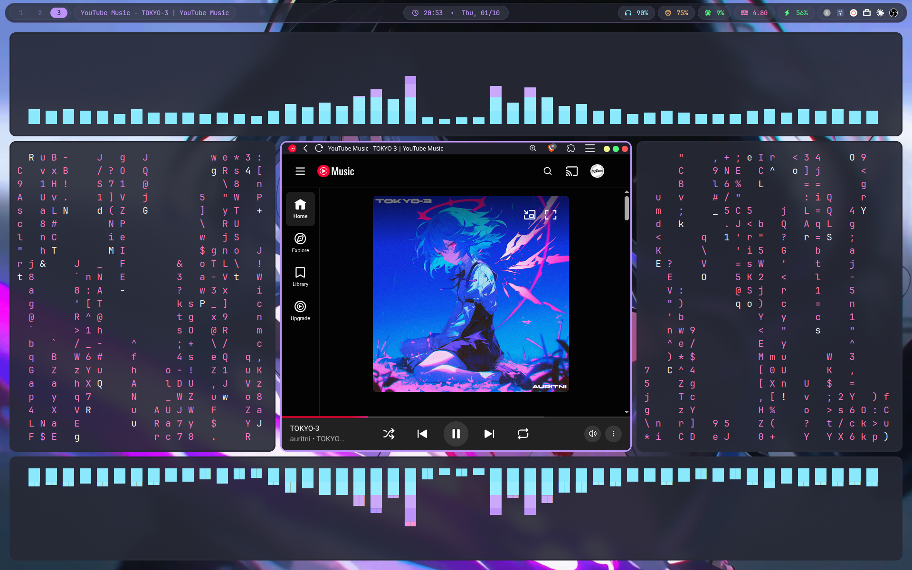

# swaywmdots

My personal dotfiles for a [Sway](https://swaywm.org/) (Wayland) desktop.




## What's included

| Folder       | Purpose                                   |
| ------------ | ----------------------------------------- |
| `sway`       | Window manager config                     |
| `waybar`     | Status bar                                |
| `rofi`       | App launcher                              |
| `swaync`     | Notification center (SwayNotificationCenter) |
| `swaylock`   | Lock screen                               |
| `quickshell` | Quickshell widgets/shell                  |
| `alacritty`  | Terminal emulator                         |
| `btop`       | System monitor                            |
| `cava`       | Audio visualizer                          |
| `fastfetch`  | System info fetch tool                    |

## Dependencies

Install the programs these configs are for:

`sway`, `swaylock`, `waybar`, `rofi` (the Wayland build / `rofi-wayland` on some distros), `swaync`, `quickshell`, `alacritty`, `btop`, `cava`, `fastfetch`

You will also likely want a Nerd Font (for Waybar/terminal icons), plus any wallpaper tools or helpers referenced in `sway/config`.

**Arch Linux example:**

```bash
sudo pacman -S sway swaylock waybar rofi-wayland swaync alacritty btop cava fastfetch
# quickshell is in the AUR
yay -S quickshell
```

On other distros, use your package manager's equivalents (or build from source where no package exists).

## Installation

### 1. Clone the repo

```bash
git clone https://github.com/shadowofdominance/swaywmdots.git ~/swaywmdots
cd ~/swaywmdots
```

### 2. Back up your existing configs (recommended)

```bash
mkdir -p ~/.config-backup
for d in alacritty btop cava fastfetch quickshell rofi sway swaylock swaync waybar; do
    [ -e ~/.config/$d ] && mv ~/.config/$d ~/.config-backup/
done
```

### 3. Install the configs

**Option A: Symlink (recommended, edits in `~/.config` update the repo)**

```bash
mkdir -p ~/.config
for d in alacritty btop cava fastfetch quickshell rofi sway swaylock swaync waybar; do
    ln -s ~/swaywmdots/$d ~/.config/$d
done
```

**Option B: Copy**

```bash
mkdir -p ~/.config
cp -r alacritty btop cava fastfetch quickshell rofi sway swaylock swaync waybar ~/.config/
```

### 4. Make scripts executable (if any)

```bash
find ~/.config/sway ~/.config/waybar ~/.config/rofi ~/.config/quickshell -type f -name "*.sh" -exec chmod +x {} +
```

### 5. Start Sway

Log out and pick **Sway** from your display manager, or run `sway` from a TTY. If you're already in Sway, reload with `Mod+Shift+C`.

## Updating

```bash
cd ~/swaywmdots
git pull
```

If you used symlinks, changes apply immediately. If you copied the files, re-run the copy step.

## Notes

- Check `sway/config` for wallpaper paths, monitor names, and keybindings, and adjust them for your setup.
- Keybindings are defined in the Sway config. Open it to see or change them.

## License

Feel free to use, modify, and share. A star is appreciated. ⭐
